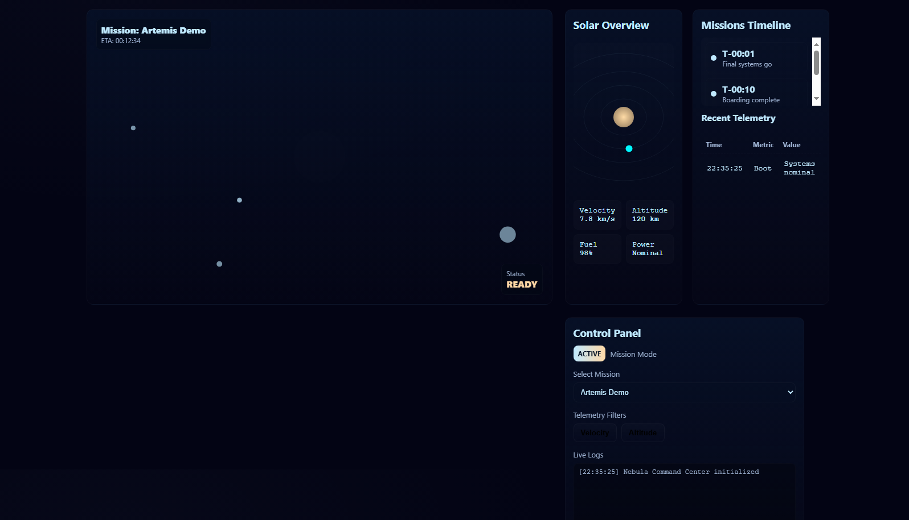

# 🌌 Nebula Command Center

Un site web très complexe inspiré du thème **NASA / mission control**, avec interface interactive, starfield, mini carte solaire, timeline de missions et panels de données.

## ✨ Fonctionnalités

* 🌠 **Starfield dynamique** en canvas avec effet de profondeur et option de grille.
* 🪐 **Mini-carte solaire animée** avec orbite de vaisseau.
* 🚀 **Simulateur de mission** : lancement, pause, mise à jour de télémétrie et logs.
* 📊 **Timeline des événements** et tableau de télémétrie en temps réel.
* 🎛 **Panneau de contrôle interactif** : sélection de mission, boutons de lancement/pause, filtres de télémétrie.
* 🖥 **Logs interactifs** avec modal pour visualiser les détails.
* ⌨️ **Contrôles clavier** : `r` pour lancer, `p` pour pause, `g` pour grille.
* 🌐 **Responsive** et design futuriste avec néons et animations.

## 🚀 Installation

Clone le repo et ouvre `index.html` dans ton navigateur :

```bash
git clone https://github.com/ton-pseudo/nebula-command-center.git
cd nebula-command-center
open index.html  # ou double-cliquez sur le fichier
```

Pas besoin de serveur, tout est en **HTML/CSS/JS pur**.

## 🛠️ Utilisation

* **Lancer la mission** : Cliquez sur `Launch Mission` ou appuyez sur `r`.
* **Pause la mission** : Cliquez sur `Pause Mission` ou appuyez sur `p`.
* **Afficher/masquer la grille** : Cliquez sur `Toggle Grid` ou appuyez sur `g`.
* **Changer la mission** : Sélectionnez une mission dans le menu déroulant.
* **Voir les logs détaillés** : Utilisez le panneau de logs ou cliquez sur une entrée pour le modal.

## 📸 Aperçu

  <!-- Ajoute un screenshot du site ici -->

## 🔧 Améliorations possibles

* Ajouter un **backend** (Node.js ou PHP) pour enregistrer la télémétrie et les logs.
* Ajouter plus de **vaisseaux et missions simulées**.
* Intégrer des **animations WebGL plus avancées** pour la carte solaire.
* Ajouter un **mode multi-utilisateur** ou un tableau de bord collaboratif.

## 📄 Licence

Projet sous licence MIT — libre d’utilisation et de modification.

---

💫 *Nebula Command Center* — conçu pour les fans d’exploration spatiale et de visualisations interactives.
